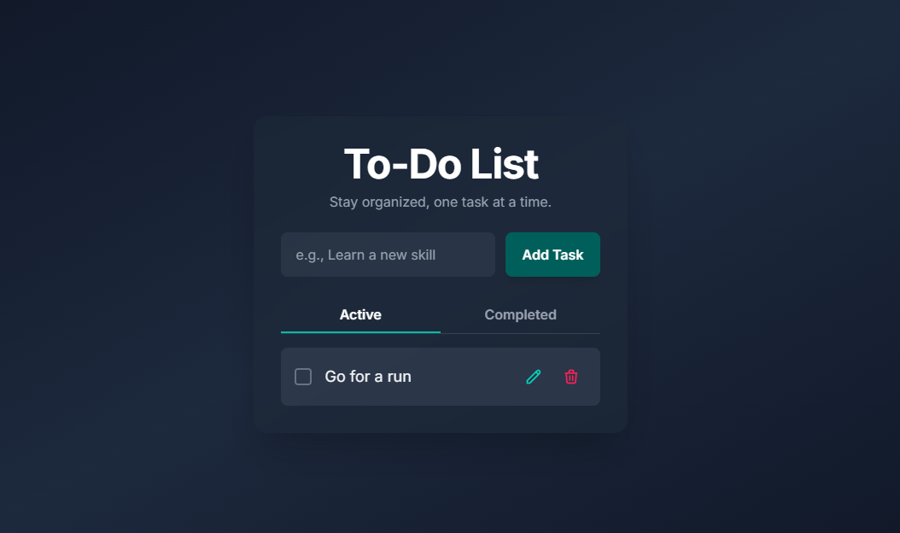
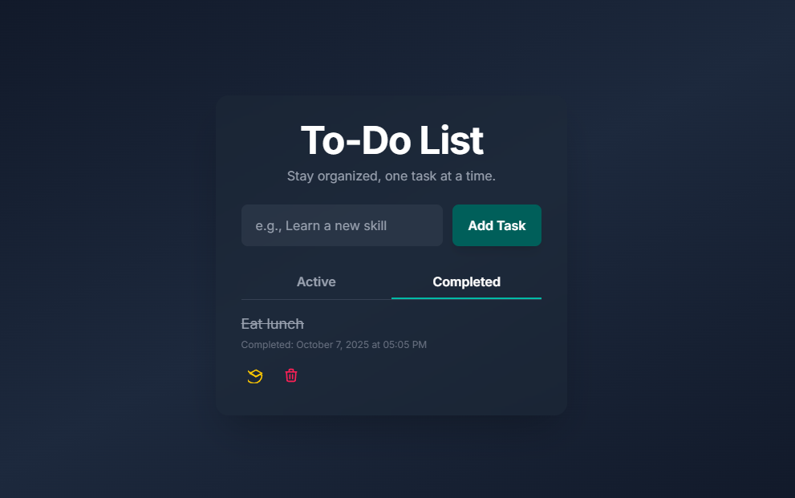

# React To-Do List App

A modern, responsive, and easy-to-use To-Do List application built with React, Tailwind CSS, and Vite.




## Features

- **Add, edit, and delete tasks**
- **Mark tasks as completed or active**
- **View active and completed tasks separately**
- **Persistent storage** using browser localStorage
- **Responsive design** for desktop and mobile
- **Animated UI** with smooth transitions
- **Accessible and keyboard-friendly**
- **Toast notifications** for user feedback

## Tech Stack

- [React](https://react.dev/)
- [Vite](https://vitejs.dev/)
- [Tailwind CSS](https://tailwindcss.com/)
- [React Toastify](https://fkhadra.github.io/react-toastify/)

## Getting Started

### Installation

1. **Clone the repository:**

   ```sh
   git clone https://github.com/your-username/your-repo-name.git
   cd your-repo-name
   ```

2. **Install dependencies:**

   ```sh
   npm install
   # or
   yarn install
   ```

3. **Start the development server:**

   ```sh
   npm run dev
   # or
   yarn dev
   ```

4. Open [http://localhost:3000](http://localhost:3000) in your browser.

## Project Structure

```
src/
  components/      # React components
  contexts/        # React context for tasks
  assets/          # Images and static assets
  index.css        # Tailwind CSS and custom styles
  App.jsx          # Main App component
  main.jsx         # Entry point
```
